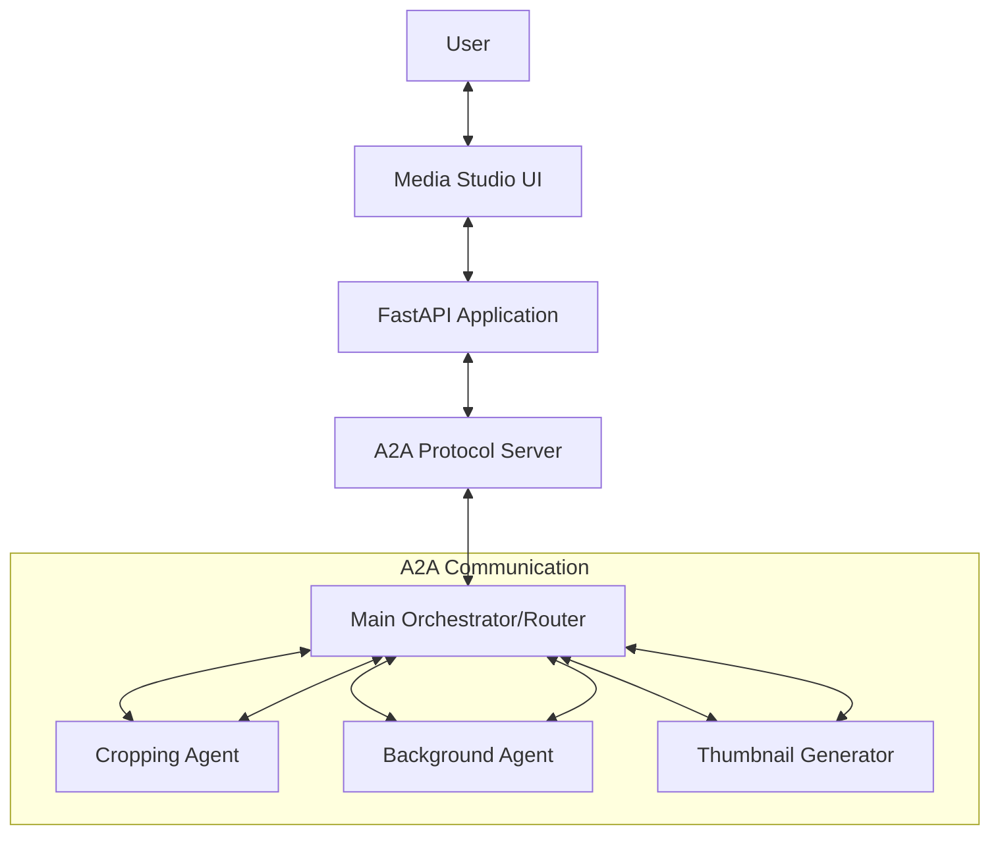

# Demo: Zava Media AI Assistant   Multi-Agent Architecture   for Image & Video Processing - Overview 

Costa Rica

[brown9804](https://github.com/brown9804)

Last updated: 2025-12-10

----------

> [!IMPORTANT]
> Disclaimer: This repository contains a demo of `Zava Media AI Assistant`, a multi-agent system implementing Agent-to-Agent (A2A) protocol for automated media generation and manipulation. It features a fully automated `"Zero-Touch" deployment` pipeline orchestrated by Terraform, which `provisions infrastructure, creates specialized AI agents for image/video tasks in MSFT Foundry, and deploys the complete A2A application stack.` Feel free to modify this as needed, it's just a reference. Please refer [TechWorkshop L300: AI Apps and Agents](https://microsoft.github.io/TechWorkshop-L300-AI-Apps-and-agents/), and if needed contact Microsoft directly: [Microsoft Sales and Support](https://support.microsoft.com/contactus?ContactUsExperienceEntryPointAssetId=S.HP.SMC-HOME) for more guidance. There are tons of free resources out there, all eager to support!

> E.g 

> [!IMPORTANT]
> The deployment process typically takes 15-20 minutes
>
> 1. Adjust [terraform.tfvars](./terraform-infrastructure/terraform.tfvars) values 
> 2. Initialize terraform with `terraform init`. Click here to [understand more about the deployment process](./terraform-infrastructure/README.md)
> 3. Run `terraform apply` - this automatically handles **all** deployment including agent creation and configuration

## Key Features

- **Media-Centric A2A Protocol**: Agent-to-Agent communication for complex image and video processing workflows
- **5-Agent Architecture**: Specialized AI agents with proper delegation through A2A protocol:
  - **Main Orchestrator**: Central request router that analyzes user requests, understands intent, and intelligently delegates tasks to specialized agents
  - **Image Cropping Specialist**: Smart object detection and cropping capabilities  
  - **Background Modification Agent**: Specialized in background removal, replacement, and scene adaptation
  - **Thumbnail Generation Agent**: Composes final assets with text overlays and layout optimization
  - **Video Processing Agent**: Specialized video analysis and frame extraction for video thumbnail generation
- **Real-Time Image Processing**: Upload or paste images directly into the chat for immediate agent action
- **Real MSFT Foundry Agents**: Integrates with **MSFT Foundry** to create and host persistent agents with proper delegation patterns
- **Zero-Touch Deployment**: A single [terraform apply](./terraform-infrastructure/README.md) command handles the entire lifecycle including enhanced A2A framework deployment
- **A2A Task Coordination**: Advanced inter-agent task delegation (e.g., "Crop this, then change background, then add text")

## About A2A Protocol

`A2A (Agent-to-Agent) Protocol is a standardized communication framework that enables multiple AI agents to collaborate and coordinate tasks seamlessly.`

> What is A2A Protocol?

- **Agent-to-Agent Communication**: Structured messaging between multiple AI agents
- **Task Coordination**: Agents can delegate tasks to specialized agents
- **Event-Driven Architecture**: Real-time event handling for agent interactions
- **Agent Discovery**: Automatic detection and registration of available agents
- **Protocol Standardization**: Consistent API for inter-agent communication

> A2A Components in This Project:

- **Agent Execution Framework**: Manages multiple agent instances (`src/a2a/server/agent_execution.py`)
- **Event System**: Handles inter-agent communication and delegation (`src/a2a/server/events/`)
- **Task Coordination**: Advanced task delegation between specialized agents (`src/a2a/server/tasks.py`)
- **Request Handlers**: Processes agent-to-agent requests with delegation routing (`src/a2a/server/request_handlers.py`)
- **Coordinator Agent**: Orchestrates complex multi-agent workflows (`src/a2a/agent/coordinator.py`)
- **Specialized Agents**: Cropping, Background, and Thumbnail agents (`src/app/agents/thumbnail_agents.py`)
- **API Endpoints**: RESTful and WebSocket APIs for enhanced agent communication (`src/a2a/api/`)

> A2A vs Traditional Multi-Agent Systems:

- **Standardized Protocol**: Uses consistent message formats and APIs
- **Scalable Architecture**: Easily add new agents without modifying existing ones
- **Real-time Communication**: WebSocket support for instant agent interactions
- **Event-Driven**: Asynchronous event handling for better performance
- **Infrastructure Integration**: Full Terraform deployment with monitoring and automation

## Architecture

## What Happens Under the Hood?

> When you run `terraform apply`, the following automated sequence occurs:

1. **Infrastructure Provisioning**:
   - Creates Resource Group, Cosmos DB, MSFT Foundry, AI Search, Storage Account, Key Vault, and Container Registry (ACR).
   - Deploys AI Models (`gpt-4o-mini`, `text-embedding-3-small`) with AI Foundry Router as core orchestrator.
   - Sets up A2A protocol infrastructure including event queues and monitoring.

      > E.g 
  
       

2. **A2A Framework Deployment**:
   - Initializes the Agent-to-Agent protocol server components.
   - Sets up event queue system for inter-agent communication.
   - Configures agent discovery and registration services.
   - Deploys A2A monitoring and automation frameworks.

3. **Data Pipeline Execution**:
   - Sets up a Python virtual environment.
   - Ingests `product_catalog.csv` into Cosmos DB with A2A event notifications.

        > E.g 

   
   - Creates and populates an Azure AI Search index with vector embeddings through A2A coordination.

        > E.g 
        

4. **Automated Agent Creation & A2A Registration**:
   - **Fully automated by terraform**: No manual intervention required
   - Installs the `azure-ai-projects` SDK and connects to MSFT Foundry
   - Creates 5 specialized media processing agents:
     - **Main Orchestrator**: Central request router and task coordinator
     - **Image Cropping Specialist**: Smart object detection and cropping
     - **Background Modification Agent**: Background removal and replacement
     - **Thumbnail Generation Agent**: Final asset composition with text overlays
     - **Video Processing Agent**: Video analysis and frame extraction
   - Automatically stores agent IDs in Azure Key Vault for secure access
   - Web app retrieves agent configuration from Key Vault automatically
   - **Zero manual configuration** - terraform handles all agent deployment and setup

      > E.g 
      

5. **Application Deployment**:
   - Builds the Docker container with A2A protocol support in the cloud (ACR Build).
   - Configures the Azure Web App with the generated Agent IDs, A2A endpoints, and credentials.
   - Deploys the container with A2A server components and restarts the app.

## Verification

> After deployment completes, verify the system:

1. **Check the Web App**:
   - The Terraform output will provide the `application_url`.
   - Visit `https://<your-app-name>.azurewebsites.net`.
   - You should see the Zava chat interface with A2A protocol support.

      > E.g 
      

2. **Verify A2A Protocol Endpoints**:
   - Check A2A Chat API: `https://<your-app-name>.azurewebsites.net/a2a/chat`
   - Check A2A Server API: `https://<your-app-name>.azurewebsites.net/a2a/api/docs`
   - Verify agent discovery: `https://<your-app-name>.azurewebsites.net/a2a/server/agents`

3. **Verify Enhanced Agent Architecture**:
   - Go to the [MSFT Foundry Portal](https://ai.azure.com).
   - Navigate to your project -> **Build** -> **Agents**.
   - You should see the 5 specialized media agents listed:
     - Main Orchestrator - Request Router
     - Image Cropping Specialist  
     - Background Modification Agent
     - Thumbnail Generation Agent
     - Video Processing Agent
   - **Agent IDs are automatically stored in Azure Key Vault** and retrieved by the web app

      > E.g 
      

4. **Test Enhanced A2A Interactions**: For example:
   - **General**: "Hi, I need a thumbnail for my video."
   - **Cropping**: "Crop the person from this image."
   - **Background**: "Change the background to a neon city."
   - **Thumbnail**: "Create a thumbnail with the text 'EPIC WIN'."
   - **Multi-Agent**: "Crop the car, put it on a race track background, and add the text 'SPEED' in red."

<!-- START BADGE -->

  
  
Refresh Date: 2025-12-04

<!-- END BADGE -->
