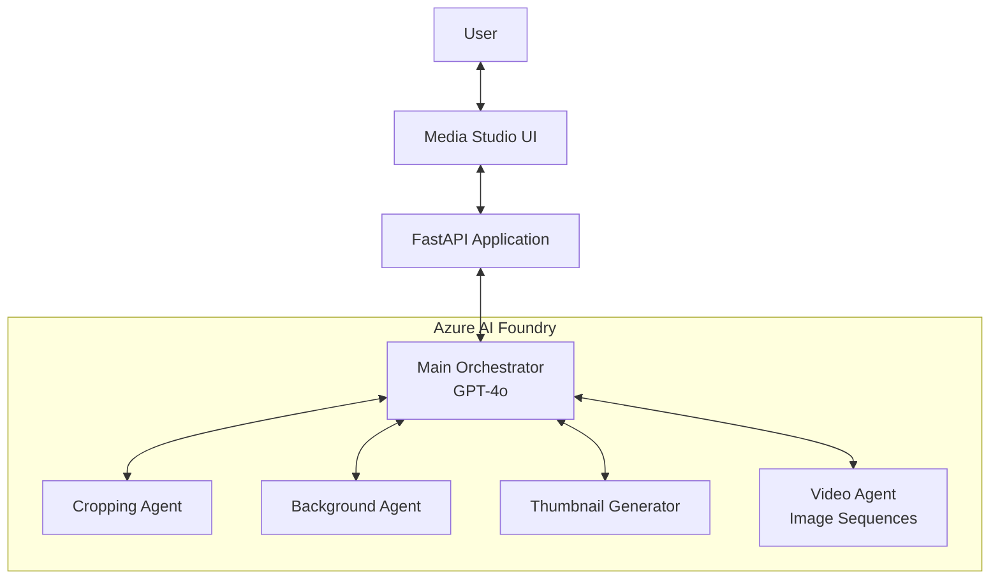

# Zava Media AI Assistant  
**Multi-Agent Architecture for Image & Video Processing**

[brown9804](https://github.com/brown9804)

Last updated: 2025-12-31

----------

<b>List of References</b> (Click to expand)

- [Foundry Models sold directly by Azure](https://learn.microsoft.com/en-us/azure/ai-foundry/foundry-models/concepts/models-sold-directly-by-azure?view=foundry-classic&pivots=azure-openai&tabs=global-standard-aoai%2Cstandard-chat-completions%2Cglobal-standard#azure-openai-in-microsoft-foundry-models) - models available 
- [Baseline architecture for an Azure Kubernetes Service (AKS) cluster](https://learn.microsoft.com/en-us/azure/architecture/reference-architectures/containers/aks/baseline-aks)
- [Run your functions from a package file in Azure](https://learn.microsoft.com/en-us/azure/azure-functions/run-functions-from-deployment-package)
- [What is Microsoft Translator Pro?](https://learn.microsoft.com/en-us/azure/ai-services/translator/solutions/translator-pro/overview)
- [Model leaderboards in Microsoft Foundry portal (preview)](https://learn.microsoft.com/en-us/azure/ai-foundry/concepts/model-benchmarks?view=foundry-classic)
- [AI Leaderboards](https://llm-stats.com/) - general ref
- [How to Stream Agent Responses](https://learn.microsoft.com/en-us/semantic-kernel/frameworks/agent/agent-streaming?utm_source=copilot.com&pivots=programming-language-python)
- [How to enable Live Streaming over Direct Line for a Copilot Studio - deployed agent?](https://github.com/Microsoft/BotFramework-WebChat/issues/5628?utm_source=copilot.com)

> [!IMPORTANT]
> Disclaimer: This repository contains a demo of `Zava Media AI Assistant`, a multi-agent system implementing Agent-to-Agent (A2A) protocol for automated media generation and manipulation. It features a fully automated `"Zero-Touch" deployment` pipeline orchestrated by Terraform, which `provisions infrastructure, creates specialized AI agents for image/video tasks in MSFT Foundry, and deploys the complete A2A application stack.` Feel free to modify this as needed, it's just a reference. Please refer [TechWorkshop L300: AI Apps and Agents](https://microsoft.github.io/TechWorkshop-L300-AI-Apps-and-agents/), and if needed contact Microsoft directly: [Microsoft Sales and Support](https://support.microsoft.com/contactus?ContactUsExperienceEntryPointAssetId=S.HP.SMC-HOME) for more guidance.

> [!IMPORTANT]
> The deployment process typically takes 15-20 minutes
>
> 1. Adjust [terraform.tfvars](./terraform-infrastructure/terraform.tfvars) values 
> 2. Initialize terraform with `terraform init`. Click here to [understand more about the deployment process](./terraform-infrastructure/README.md)
> 3. Run `terraform apply` - this automatically handles **all** deployment including agent creation and configuration

## Key Features

- **Media-Centric AI Processing**: Specialized agents for image and video manipulation workflows
- **5-Agent Architecture**: Specialized AI agents with intelligent task delegation:
  - **Main Orchestrator**: Central request router that analyzes user requests and delegates to specialized agents
  - **Image Cropping Specialist**: Smart object detection and cropping
  - **Background Modification Agent**: Background removal/replacement
  - **Thumbnail Generation Agent**: Composes final assets with text overlays
  - **Video Processing Agent**: Video generation via image sequences (temporary until Sora-2 available)
- **Real-Time Image Processing**: Upload or paste images directly into the chat for immediate agent action
- **Real MSFT Foundry Agents**: Integrates with **MSFT Foundry** to create and host persistent agents
- **Zero-Touch Deployment**: A single [terraform apply](./terraform-infrastructure/README.md) command handles the entire lifecycle
- **Advanced Task Coordination**: Inter-agent task delegation (e.g., "Crop this, then change background, then add text")

## Specialized Models

Each agent uses a specific model optimized for its task:
- **GPT-4o**: Orchestration, routing, and **vision/image understanding** (multi-modal)
- **GPT-4o-mini**: Smaller, faster model for general tasks
- **DALL-E-3**: Image generation and synthesis
- **FLUX.2-pro**: Advanced artistic image generation
- **text-embedding-3-small**: Embeddings for vector search
- **Sora**: Native video generation model

> [!NOTE]
> **Multi-Model SME Collaboration for Image Generation**
> 
> This solution uses a **collaborative multi-agent approach** where multiple AI models work together as Subject Matter Experts (SMEs):
> 
> **Primary Team (Deploys Together):**
> - **GPT-4o (Vision)**: Analyzes images, understands context, provides editing guidance
> - **FLUX.2-pro**: Generates artistic, high-quality images
> - **DALL-E-3**: Generates alternative styles and interpretations
>
> **How They Work Together:**
> 1. **GPT-4o analyzes** the user's request and existing images using its vision capabilities
> 2. **FLUX.2-pro generates** the primary artistic output
> 3. **DALL-E-3 provides** alternative interpretations or refinements
> 4. **GPT-4o evaluates** results and can request iterations
> 5. System presents **multiple options** or blends the best elements
>
> **Benefits of Multi-Model Collaboration:**
> - Higher quality results from combining different model strengths
> - More creative variety with different artistic styles
> - Better accuracy through GPT-4o's vision-based validation
> - Redundancy: if one model fails/unavailable, others continue working
>
> **Quota Considerations**: 
> - All models attempt to deploy during `terraform apply`
> - If DALL-E-3 quota unavailable: **GPT-4o + FLUX.2-pro** continue as SME team
> - If FLUX.2-pro unavailable: **GPT-4o + DALL-E-3** work together
> - Minimum viable: **GPT-4o alone** (has vision + basic image capabilities)
> - To request quota: [Azure Quota Increase Request](https://portal.azure.com/#blade/Microsoft_Azure_Support/HelpAndSupportBlade/newsupportrequest)

> [!NOTE]
> **Video Generation with Sora**
> 
> This solution now uses **Sora** (version 2025-05-02) for native video generation in Azure AI Foundry.
> 
> **Fallback Strategy**: If Sora is unavailable, the system falls back to generating image sequences using the SME team (GPT-4o + FLUX.2-pro + DALL-E-3) and stitching them into videos.
>
> **Sora Deployment**: The model is automatically deployed during `terraform apply` if available in your region.

> [!WARNING]
> **Azure Quota and Model Availability**
> The models listed above (`gpt-4o`, `dall-e-3`, `FLUX.2-pro`, etc.) are the recommended, state-of-the-art choices for these media tasks. However, they require significant GPU capacity and are subject to strict Azure quotas.
>
> **If you encounter deployment errors related to "Insufficient Quota", it means your Azure subscription does not have access to these models in the selected region.**
>
> To resolve this, you must [request a quota increase from Microsoft Azure](https://portal.azure.com/#blade/Microsoft_Azure_Support/HelpAndSupportBlade/newsupportrequest).
>
> ### Alternative Models (Quota-Friendly)
> As a fallback, this project is configured to use `gpt-4o-mini` for all agent tasks. This model is more widely available and has less restrictive quotas. While not as powerful as the specialized models, `gpt-4o-mini` provides a good baseline for multi-modal tasks and allows the application to run successfully even without access to the larger models.

## Architecture

```mermaid
graph TD
    User[User] <--> UI[Media Studio UI]
    UI <--> App[FastAPI Application]
    App <--> Orchestrator[Main Orchestrator<br/>GPT-4o]
    
    Orchestrator <--> Crop[Cropping Agent]
    Orchestrator <--> BG[Background Agent]
    Orchestrator <--> Thumb[Thumbnail Generator]
    Orchestrator <--> Video[Video Agent<br/>Image Sequences]
    
    subgraph "Azure AI Foundry"
        Orchestrator
        Crop
        BG
        Thumb
        Video
    end
```

## What Happens Under the Hood?

> When you run `terraform apply`, the following automated sequence occurs:

1. **Infrastructure Provisioning**:
   - Creates Resource Group, Azure AI Foundry, Key Vault, Storage Account, and Container Registry (ACR)
   - Deploys specialized AI Models:
     - **GPT-4o** (Orchestration and main reasoning)
     - **GPT-4o-mini** (Fast, efficient general tasks)
     - **DALL-E-3** (Image generation)
     - **FLUX.2-pro** (Advanced artistic images)
     - **text-embedding-3-small** (Vector embeddings)
     - **Video**: Image sequences via DALL-E-3/FLUX.2-pro (temporary until Sora-2 available)
   - All models use **Managed Identity** for secure authentication (no API keys stored)

2. **Automated Agent Creation**:
   - **Fully automated by Terraform**: No manual intervention required
   - Installs the `azure-ai-projects` SDK and connects to MSFT Foundry
   - Creates specialized media processing agents with specific model assignments
   - Automatically stores agent IDs in Azure Key Vault for secure access
   - Web app retrieves agent configuration from Key Vault automatically
   - **Zero manual configuration** - Terraform handles all agent deployment and setup

3. **Application Deployment**:
   - Builds the Docker container in the cloud (ACR Build)
   - Configures the Azure Web App with the generated Agent IDs and Managed Identity
   - Deploys the container and restarts the app

## Verification

> After deployment completes, verify the system:

1. **Check the Web App**:
   - The Terraform output will provide the `application_url`
   - Visit `https://<your-app-name>.azurewebsites.net`
   - You should see the Zava Media AI interface

2. **Verify Agent Architecture**:
   - Go to the [MSFT Foundry Portal](https://ai.azure.com)
   - Navigate to your project -> **Build** -> **Agents**
   - You should see the specialized media agents listed with their assigned models
   - **Agent IDs are automatically stored in Azure Key Vault** and retrieved by the web app

3. **Test Media Processing**: For example:
   - **Image Upload**: Upload an image and ask "Crop the main subject"
   - **Background**: "Change the background to a beach scene"
   - **Thumbnail**: "Create a thumbnail with the text 'AMAZING'"
   - **Multi-Step**: "Crop the car, put it on a race track background, and add the text 'SPEED' in red"
   - **Video**: "Generate a 5-second video of a sunset over mountains"

<!-- START BADGE -->

  
  
Refresh Date: 2025-12-04

<!-- END BADGE -->
