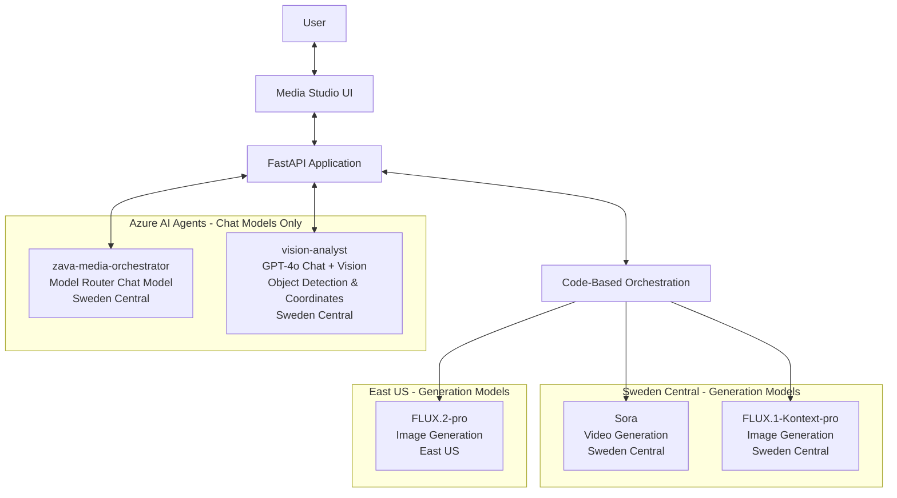

# Demo: Zava Media AI Assistant   Multi-Agent Architecture   for Image & Video Processing - Overview 

Costa Rica 

[brown9804](https://github.com/brown9804)

Last updated: 2026-01-08

----------

<b>List of References</b> (Click to expand)

- [Foundry Models sold directly by Azure](https://learn.microsoft.com/en-us/azure/ai-foundry/foundry-models/concepts/models-sold-directly-by-azure?view=foundry-classic&pivots=azure-openai&tabs=global-standard-aoai%2Cstandard-chat-completions%2Cglobal-standard#azure-openai-in-microsoft-foundry-models) - models available 
- [Timelines for Foundry Models](https://learn.microsoft.com/en-us/azure/ai-foundry/concepts/model-lifecycle-retirement?view=foundry-classic#timelines-for-foundry-models) - retirement dates
- [Azure OpenAI in Microsoft Foundry model deprecations and retirements](https://learn.microsoft.com/en-us/azure/ai-foundry/openai/concepts/model-retirements?view=foundry-classic&tabs=text#current-models) - deprecation Date
- [Use model router for Microsoft Foundry](https://learn.microsoft.com/en-us/azure/ai-foundry/openai/how-to/model-router?view=foundry-classic) - model-router LLMs
- [Model summary table and region availability](https://learn.microsoft.com/en-us/azure/ai-foundry/foundry-models/concepts/models-sold-directly-by-azure?view=foundry-classic&pivots=azure-openai&tabs=global-standard-aoai%2Cstandard-chat-completions%2Cglobal-standard#model-summary-table-and-region-availability) - table summary
- [Baseline architecture for an Azure Kubernetes Service (AKS) cluster](https://learn.microsoft.com/en-us/azure/architecture/reference-architectures/containers/aks/baseline-aks)
- [Run your functions from a package file in Azure](https://learn.microsoft.com/en-us/azure/azure-functions/run-functions-from-deployment-package)
- [What is Microsoft Translator Pro?](https://learn.microsoft.com/en-us/azure/ai-services/translator/solutions/translator-pro/overview)
- [Model leaderboards in Microsoft Foundry portal (preview)](https://learn.microsoft.com/en-us/azure/ai-foundry/concepts/model-benchmarks?view=foundry-classic)
- [AI Leaderboards](https://llm-stats.com/) - general ref
- [How to Stream Agent Responses](https://learn.microsoft.com/en-us/semantic-kernel/frameworks/agent/agent-streaming?utm_source=copilot.com&pivots=programming-language-python)
- [How to enable Live Streaming over Direct Line for a Copilot Studio - deployed agent?](https://github.com/Microsoft/BotFramework-WebChat/issues/5628?utm_source=copilot.com)
- [Azure OpenAI Responses API](https://learn.microsoft.com/en-us/azure/ai-foundry/openai/how-to/responses?view=foundry-classic&tabs=python-key)
- [Foundry Control Plane: Managing AI agents at scale | BRK202](https://www.youtube.com/watch?v=XjVj_qRwzVg)

> [!IMPORTANT]
> Disclaimer: This repository contains a demo of `Zava Media AI Assistant`, a hybrid system using **2 Azure AI Agents** (via Azure AI Agents Service) for conversational orchestration and cropping, with **code-based orchestration** for other media tasks (video, image generation, document processing). It features a fully automated `"Zero-Touch" deployment` pipeline orchestrated by Terraform, which `provisions infrastructure, creates specialized AI agents in MSFT Foundry, and deploys the complete application stack.` Feel free to modify this as needed, it's just a reference. Please refer [TechWorkshop L300: AI Apps and Agents](https://microsoft.github.io/TechWorkshop-L300-AI-Apps-and-agents/), and if needed contact Microsoft directly: [Microsoft Sales and Support](https://support.microsoft.com/contactus?ContactUsExperienceEntryPointAssetId=S.HP.SMC-HOME) for more guidance.

> E.g

> [!IMPORTANT]
> The deployment process `typically takes 15-20 minutes`
>
> 1. Adjust [terraform.tfvars](./terraform-infrastructure/terraform.tfvars) values 
> 2. Initialize terraform with `terraform init`. Click here to [understand more about the deployment process](./terraform-infrastructure/README.md)
> 3. Run `terraform apply` - this automatically handles **all** deployment including agent creation and configuration

## Key Features

> [!WARNING]
>
> - **Multi-Region Deployment**: Sweden Central hosts 4 models + 2 agents, East US hosts 1 model.
> - All models use **GlobalStandard** SKU for optimal performance and availability.

> For example East US \& Sweden Central:

| East US | Sweden Central | 
| --- | ---- | 
|  |  | 

- **Hybrid Agent Architecture**: 2 Azure AI Agents for chat-based orchestration + code-based orchestration for media processing
- **Multi-Region Deployment**: 
  - **Sweden Central**: 4 models + 2 agents
    - **Models**: model-router, GPT-4o, Sora, FLUX.1-Kontext-pro
    - **Agents**: `zava-media-orchestrator`, `vision-analyst`
  - **East US**: 1 model (no agents)
    - **Models**: FLUX.2-pro
- **2 Azure AI Agents** (chat-based via Responses API):
  - **`zava-media-orchestrator`**: Central request router using `model-router` chat model. `Routes to 18+ other models`
  - **`vision-analyst`**: Object detection and coordinate analysis using `GPT-4o` chat model with vision (provides JSON coordinates via HTTPS). ~ `Analyzes images to detect objects and return bounding box coordinates as JSON. Application code handles actual image manipulation (cropping, resizing, etc.) using the provided coordinates.`
- **Code-Based Orchestration** for generation tasks:
  - **Video Generation**: Direct calls to `Sora` (Sweden Central). ~ `Video generation model (not used by agents, called directly via code)`
  - **Image Generation**: Direct calls to `FLUX.1-Kontext-pro` (Sweden Central) ~ `Image generation model (not used by agents, called directly via code)` and `FLUX.2-pro` (East US) ~ `Image generation model (not used by agents, called directly via code)`.
- **Real-Time Image Processing**: Upload or paste images directly into the chat for immediate agent action
- **Real MSFT Foundry Agents**: Integrates with **MSFT Foundry** to create and host persistent agents across multiple projects
- **Zero-Touch Deployment**: A single [terraform apply](./terraform-infrastructure/README.md) command handles the entire lifecycle
- **Advanced Task Coordination**: Inter-agent task delegation (e.g., "Crop this, then change background, then add text")
- **Dynamic Configuration**: All settings managed via [terraform.tfvars](./terraform-infrastructure/terraform.tfvars) - `no code changes needed, just add your values here`

## Architecture Overview

> [!IMPORTANT]
> Agents use CHAT models only (not image generation models). GPT-4o is a **chat model with vision**, `it can see/analyze images in conversation but doesn't generate images.`

> **How It Works:**
>
> 1. **Orchestrator Agent** (model-router - chat model) receives user requests and routes appropriately
> 2. **Vision Analyst Agent** (GPT-4o - chat model with vision) can SEE images in chat and provide object detection coordinates via JSON
> 3. **Code Orchestration** calls generation models directly:
>    - Video generation (Sora - not an agent, direct API call)
>    - Image generation (FLUX.1-Kontext-pro - not an agent, direct API call)
> 4. **Key Distinction**: 
>    - **Agents = Chat Models** (model-router, GPT-4o) for conversation and analysis
>    - **Code = Generation Models** (Sora, FLUX) for creating videos/images
>    - GPT-4o is a CHAT model that can see images, NOT an image generation model

> [!WARNING]
> **Azure Quota and Model Availability**
> The models deployed (`model-router`, `GPT-4o`, `FLUX.2-pro`, `FLUX.1-Kontext-pro`, `Sora`) require GPU capacity and are subject to Azure quotas. **If you encounter deployment errors related to "Insufficient Quota"**, request a quota increase: [Azure Support](https://portal.azure.com/#blade/Microsoft_Azure_Support/HelpAndSupportBlade/newsupportrequest)

## Architecture

```mermaid
graph TD
    User[User] <--> UI[Media Studio UI]
    UI <--> App[FastAPI Application]
    
    App <--> Orchestrator[zava-media-orchestrator<br/>Model Router Chat Model<br/>Sweden Central]
    App <--> Vision[vision-analyst<br/>GPT-4o Chat + Vision<br/>Object Detection & Coordinates<br/>Sweden Central]
    
    App <--> CodeOrch[Code-Based Orchestration]
    
    CodeOrch --> Sora[Sora<br/>Video Generation<br/>Sweden Central]
    CodeOrch --> FLUX1[FLUX.1-Kontext-pro<br/>Image Generation<br/>Sweden Central]
    CodeOrch --> FLUX2[FLUX.2-pro<br/>Image Generation<br/>East US]
    
    subgraph "Azure AI Agents - Chat Models Only"
        Orchestrator
        Vision
    end
    
    subgraph "Sweden Central - Generation Models"
        Sora
        FLUX1
    end
    
    subgraph "East US - Generation Models"
        FLUX2
    end
```

> **Architecture Distribution:**
>
> - **2 Azure AI Agents (Sweden Central)**: `zava-media-orchestrator` (model-router), `vision-analyst` (GPT-4o)
> - **Generation Models**: Sora, FLUX.1-Kontext-pro (Sweden Central), FLUX.2-pro (East US)
> - **Key**: As now, Agents use chat models per Azure AI Agents SDK design

## What Happens Under the Hood?

> When you run `terraform apply`, the following automated sequence occurs:

1. **Infrastructure Provisioning**:
   - Creates Resource Group, 2 Azure AI Foundry projects (Sweden Central + East US), Key Vault, Storage Account, and Container Registry (ACR)
   - **Multi-Region Model Deployment**:
     - **Sweden Central (4 models)**:
       - **Model Router** (Orchestrator - automatic model selection from 18+ options)
       - **GPT-4o** (Vision and cropping tasks)
       - **Sora** (Native video generation)
       - **FLUX.1-Kontext-pro** (Document processing and contextual understanding)
     - **East US (1 model)**:
       - **FLUX.2-pro** (Background generation, thumbnail creation, artistic image manipulation)
   - All models use **GlobalStandard** SKU for optimal performance
   - All resources use **Managed Identity** for secure authentication (no API keys stored)

2. **Automated Agent Creation**:
   - **Fully automated by Terraform**: No manual intervention required
   - Installs the `azure-ai-projects` SDK and connects to MSFT Foundry projects in both regions
   - Creates specialized media processing agents:
     - **Sweden Central**: `zava-media-orchestrator`, `vision-analyst`
     - **East US**: No agents (Models accessed directly via code)
   - Automatically stores agent IDs in Azure Key Vault for secure access with region prefixes
   - Web app retrieves agent configuration from Key Vault automatically
   - **Zero manual configuration** - Terraform handles all multi-region agent deployment and setup

3. **Application Deployment**:
   - Builds the Docker container in the cloud (ACR Build)
   - Configures the Azure Web App with the generated Agent IDs and Managed Identity
   - Deploys the container and restarts the app

## Verification

> After deployment completes, verify the system:

1. **Check the Web App**:
   - The Terraform output will provide the `application_url`
   - Visit `https://<your-app-name>.azurewebsites.net`
   - You should see the Zava Media AI interface
    
       <https://github.com/user-attachments/assets/9422d50b-a2ca-4ae4-bf01-ab3090d60313>

2. **Verify Agent Architecture**:
   - Go to the [MSFT Foundry Portal](https://ai.azure.com)
   - Check **Sweden Central Project** -> **Build** -> **Agents**:
     - Should see: `zava-media-orchestrator` and `vision-analyst`
   - Check **East US Project**:
     - Note: No agents are created in East US. The FLUX.2-pro model is accessed directly via code.
   - **Agent IDs are automatically stored in Azure Key Vault** with region prefixes and retrieved by the web app

3. **Test Media Processing**: For example:
   - **Image Upload**: Upload an image and ask "Crop the main subject"
   - **Background**: "Change the background to a beach scene" (routed to East US for fast generation)
   - **Thumbnail**: "Create a thumbnail with the text 'AMAZING'" (routed to East US)
   - **Multi-Step**: "Crop the car, put it on a race track background, and add the text 'SPEED' in red"
   - **Video**: "Generate a 5-second video of a sunset over mountains" (Sweden Central - Sora)
   - **Document**: "Extract all text from this PDF" or "Summarize this document" (Sweden Central - FLUX.1-Kontext-pro)

<!-- START BADGE -->

  
  
Refresh Date: 2026-01-08

<!-- END BADGE -->
