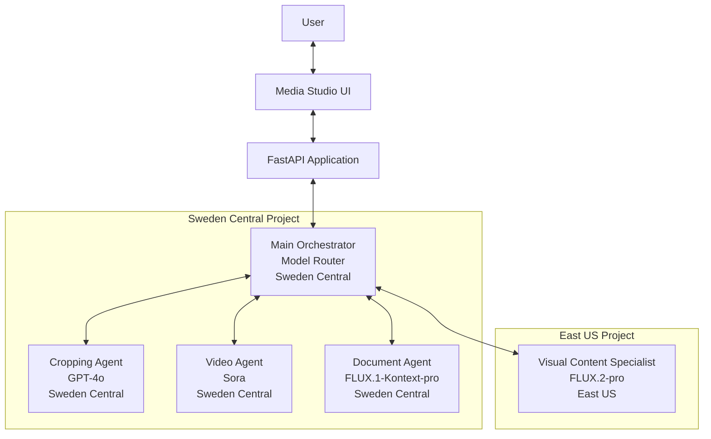

# Demo: Zava Media AI Assistant   Multi-Agent Architecture   for Image & Video Processing - Overview 

[brown9804](https://github.com/brown9804)

Last updated: 2026-01-08

----------

<b>List of References</b> (Click to expand)

- [Foundry Models sold directly by Azure](https://learn.microsoft.com/en-us/azure/ai-foundry/foundry-models/concepts/models-sold-directly-by-azure?view=foundry-classic&pivots=azure-openai&tabs=global-standard-aoai%2Cstandard-chat-completions%2Cglobal-standard#azure-openai-in-microsoft-foundry-models) - models available 
- [Timelines for Foundry Models](https://learn.microsoft.com/en-us/azure/ai-foundry/concepts/model-lifecycle-retirement?view=foundry-classic#timelines-for-foundry-models) - retirement dates
- [Azure OpenAI in Microsoft Foundry model deprecations and retirements](https://learn.microsoft.com/en-us/azure/ai-foundry/openai/concepts/model-retirements?view=foundry-classic&tabs=text#current-models) - deprecation Date
- [Use model router for Microsoft Foundry](https://learn.microsoft.com/en-us/azure/ai-foundry/openai/how-to/model-router?view=foundry-classic) - model-router LLMs
- [Model summary table and region availability](https://learn.microsoft.com/en-us/azure/ai-foundry/foundry-models/concepts/models-sold-directly-by-azure?view=foundry-classic&pivots=azure-openai&tabs=global-standard-aoai%2Cstandard-chat-completions%2Cglobal-standard#model-summary-table-and-region-availability) - table summary
- [Baseline architecture for an Azure Kubernetes Service (AKS) cluster](https://learn.microsoft.com/en-us/azure/architecture/reference-architectures/containers/aks/baseline-aks)
- [Run your functions from a package file in Azure](https://learn.microsoft.com/en-us/azure/azure-functions/run-functions-from-deployment-package)
- [What is Microsoft Translator Pro?](https://learn.microsoft.com/en-us/azure/ai-services/translator/solutions/translator-pro/overview)
- [Model leaderboards in Microsoft Foundry portal (preview)](https://learn.microsoft.com/en-us/azure/ai-foundry/concepts/model-benchmarks?view=foundry-classic)
- [AI Leaderboards](https://llm-stats.com/) - general ref
- [How to Stream Agent Responses](https://learn.microsoft.com/en-us/semantic-kernel/frameworks/agent/agent-streaming?utm_source=copilot.com&pivots=programming-language-python)
- [How to enable Live Streaming over Direct Line for a Copilot Studio - deployed agent?](https://github.com/Microsoft/BotFramework-WebChat/issues/5628?utm_source=copilot.com)
- [Azure OpenAI Responses API](https://learn.microsoft.com/en-us/azure/ai-foundry/openai/how-to/responses?view=foundry-classic&tabs=python-key)
- [Foundry Control Plane: Managing AI agents at scale | BRK202](https://www.youtube.com/watch?v=XjVj_qRwzVg)

> [!IMPORTANT]
> Disclaimer: This repository contains a demo of `Zava Media AI Assistant`, a multi-agent system implementing Agent-to-Agent (A2A) protocol for automated media generation and manipulation. It features a fully automated `"Zero-Touch" deployment` pipeline orchestrated by Terraform, which `provisions infrastructure, creates specialized AI agents for image/video tasks in MSFT Foundry, and deploys the complete A2A application stack.` Feel free to modify this as needed, it's just a reference. Please refer [TechWorkshop L300: AI Apps and Agents](https://microsoft.github.io/TechWorkshop-L300-AI-Apps-and-agents/), and if needed contact Microsoft directly: [Microsoft Sales and Support](https://support.microsoft.com/contactus?ContactUsExperienceEntryPointAssetId=S.HP.SMC-HOME) for more guidance.

> E.g

> [!IMPORTANT]
> The deployment process `typically takes 15-20 minutes`
>
> 1. Adjust [terraform.tfvars](./terraform-infrastructure/terraform.tfvars) values 
> 2. Initialize terraform with `terraform init`. Click here to [understand more about the deployment process](./terraform-infrastructure/README.md)
> 3. Run `terraform apply` - this automatically handles **all** deployment including agent creation and configuration

## Key Features

> [!WARNING]
> **Multi-Region Deployment**: Sweden Central hosts 4 models, East US hosts 1 model. All models use **GlobalStandard** SKU for optimal performance and availability.

> For example East US \& Sweden Central:

| East US | Sweden Central | 
| --- | ---- | 
|  |  | 

- **Media-Centric AI Processing**: Specialized agents for image, video, and document manipulation workflows
- **Multi-Region Architecture**: 2 Azure AI Foundry projects across 2 regions for optimal performance:
  - **Sweden Central** (Primary): 4 agents + 4 models (orchestration, cropping, video, documents)
  - **East US** (Secondary): 1 agent + 1 model (visual content generation with low latency)
- **5-Agent Architecture**: Specialized AI agents with intelligent task delegation:
  - **Main Orchestrator** (Sweden): Central request router (`model-router`) with 18-model intelligent routing
  - **Cropping Specialist** (Sweden): Smart object detection and cropping (`GPT-4o vision`)
  - **Visual Content Specialist** (East US): Background removal/replacement + thumbnail generation (`FLUX.2-pro`)
  - **Video Processing Agent** (Sweden): Native video generation with `Sora`
  - **Document Processor** (Sweden): PDF/document analysis and extraction (`FLUX.1-Kontext-pro`)
- **Real-Time Image Processing**: Upload or paste images directly into the chat for immediate agent action
- **Real MSFT Foundry Agents**: Integrates with **MSFT Foundry** to create and host persistent agents across multiple projects
- **Zero-Touch Deployment**: A single [terraform apply](./terraform-infrastructure/README.md) command handles the entire lifecycle
- **Advanced Task Coordination**: Inter-agent task delegation (e.g., "Crop this, then change background, then add text")
- **Dynamic Configuration**: All settings managed via [terraform.tfvars](./terraform-infrastructure/terraform.tfvars) - `no code changes needed, just add your values here`

## Specialized Agents (SMEs) (5 Total)

> Each agent uses a specialized model as its "brain" optimized for its domain:

**Sweden Central (4 models):**

- **Model Router** (Orchestrator): Azure OpenAI Model Router (2025-11-18) ~ Intelligent routing across 18 models, `routes requests to optimal model among 18 options`. Click here to read more about it [Use model router for Microsoft Foundry](https://learn.microsoft.com/en-us/azure/ai-foundry/openai/how-to/model-router?view=foundry-classic)
- **GPT-4o** (Cropping Agent): Vision and image understanding capabilities. ~ `Vision-based object detection and cropping coordination`
- **Sora** (Video Agent): Native video generation from text prompts `with smooth, realistic motion`
- **FLUX.1-Kontext-pro** (Document Agent): Contextual understanding and PDF/document processing. ~ `Extracts text, analyzes PDFs, understands document context`

**East US (1 model):**

- **FLUX.2-pro** (Visual Content Agent): Advanced artistic image generation, background manipulation, and thumbnail creation. ~ `Consolidated agent for backgrounds, thumbnails, and artistic image generation with low latency`

> For example:

| Model | Agent | 
| --- | ---- | 
|  |  | 

> **How They Work Together?**
>
> 1. **Orchestrator** (Sweden - model-router) receives all requests and routes to appropriate specialist
> 2. **Cropping Agent** (Sweden - GPT-4o) uses vision to identify and crop objects
> 3. **Visual Content Specialist** (East US - FLUX.2-pro) handles backgrounds and thumbnails with co-located model for fast generation
> 4. **Video Agent** (Sweden - Sora) creates smooth, high-quality videos from text descriptions
> 5. **Document Agent** (Sweden - FLUX.1-Kontext-pro) processes PDFs and extracts structured information

**Benefits of Multi-Region Architecture:**

> - **Specialized models per domain**: Each model excels at its specific task (vision, generation, video, documents)
> - **Optimized latency**: Visual content generation co-located with FLUX.2-pro in East US for fast image operations
> - **Geographic distribution**: Primary processing in Sweden Central, intensive image generation in East US
> - **Intelligent routing**: Model Router automatically selects best model for each request
> - **Consolidated workflows**: Visual Content Specialist handles multiple related tasks (backgrounds + thumbnails) efficiently

> [!WARNING]
> **Azure Quota and Model Availability**
> The models deployed (`model-router`, `GPT-4o`, `FLUX.2-pro`, `FLUX.1-Kontext-pro`, `Sora`) require GPU capacity and are subject to Azure quotas. **If you encounter deployment errors related to "Insufficient Quota"**, request a quota increase: [Azure Support](https://portal.azure.com/#blade/Microsoft_Azure_Support/HelpAndSupportBlade/newsupportrequest)

## Architecture

```mermaid
graph TD
    User[User] <--> UI[Media Studio UI]
    UI <--> App[FastAPI Application]
    App <--> Orchestrator[Main Orchestrator<br/>Model Router<br/>Sweden Central]
    
    Orchestrator <--> Crop[Cropping Agent<br/>GPT-4o<br/>Sweden Central]
    Orchestrator <--> Visual[Visual Content Specialist<br/>FLUX.2-pro<br/>East US]
    Orchestrator <--> Video[Video Agent<br/>Sora<br/>Sweden Central]
    Orchestrator <--> Doc[Document Agent<br/>FLUX.1-Kontext-pro<br/>Sweden Central]
    
    subgraph "Sweden Central Project"
        Orchestrator
        Crop
        Video
        Doc
    end
    
    subgraph "East US Project"
        Visual
    end
```

**Multi-Region Agent Distribution:**

> - **Sweden Central**: Orchestrator, Cropping Specialist, Video Agent, Document Processor
> - **East US**: Visual Content Specialist (backgrounds + thumbnails)

## What Happens Under the Hood?

> When you run `terraform apply`, the following automated sequence occurs:

1. **Infrastructure Provisioning**:
   - Creates Resource Group, 2 Azure AI Foundry projects (Sweden Central + East US), Key Vault, Storage Account, and Container Registry (ACR)
   - **Multi-Region Model Deployment**:
     - **Sweden Central (4 models)**:
       - **Model Router** (Orchestrator - automatic model selection from 18+ options)
       - **GPT-4o** (Vision and cropping tasks)
       - **Sora** (Native video generation)
       - **FLUX.1-Kontext-pro** (Document processing and contextual understanding)
     - **East US (1 model)**:
       - **FLUX.2-pro** (Background generation, thumbnail creation, artistic image manipulation)
   - All models use **GlobalStandard** SKU for optimal performance
   - All resources use **Managed Identity** for secure authentication (no API keys stored)

2. **Automated Agent Creation**:
   - **Fully automated by Terraform**: No manual intervention required
   - Installs the `azure-ai-projects` SDK and connects to MSFT Foundry projects in both regions
   - Creates specialized media processing agents with region-specific model assignments:
     - **Sweden Central**: Orchestrator, Cropping Specialist, Video Agent, Document Processor
     - **East US**: Visual Content Specialist
   - Automatically stores agent IDs in Azure Key Vault for secure access with region prefixes
   - Web app retrieves agent configuration from Key Vault automatically
   - **Zero manual configuration** - Terraform handles all multi-region agent deployment and setup

3. **Application Deployment**:
   - Builds the Docker container in the cloud (ACR Build)
   - Configures the Azure Web App with the generated Agent IDs and Managed Identity
   - Deploys the container and restarts the app

## Verification

> After deployment completes, verify the system:

1. **Check the Web App**:
   - The Terraform output will provide the `application_url`
   - Visit `https://<your-app-name>.azurewebsites.net`
   - You should see the Zava Media AI interface

2. **Verify Agent Architecture**:
   - Go to the [MSFT Foundry Portal](https://ai.azure.com)
   - Check **Sweden Central Project** -> **Build** -> **Agents**:
     - Should see: Orchestrator, Cropping Specialist, Video Agent, Document Processor (4 agents)
   - Check **East US Project** -> **Build** -> **Agents**:
     - Should see: Visual Content Specialist (1 agent)
   - **Agent IDs are automatically stored in Azure Key Vault** with region prefixes and retrieved by the web app

3. **Test Media Processing**: For example:
   - **Image Upload**: Upload an image and ask "Crop the main subject"
   - **Background**: "Change the background to a beach scene" (routed to East US for fast generation)
   - **Thumbnail**: "Create a thumbnail with the text 'AMAZING'" (routed to East US)
   - **Multi-Step**: "Crop the car, put it on a race track background, and add the text 'SPEED' in red"
   - **Video**: "Generate a 5-second video of a sunset over mountains" (Sweden Central - Sora)
   - **Document**: "Extract all text from this PDF" or "Summarize this document" (Sweden Central - FLUX.1-Kontext-pro)

<!-- START BADGE -->

  
  
Refresh Date: 2026-01-08

<!-- END BADGE -->
