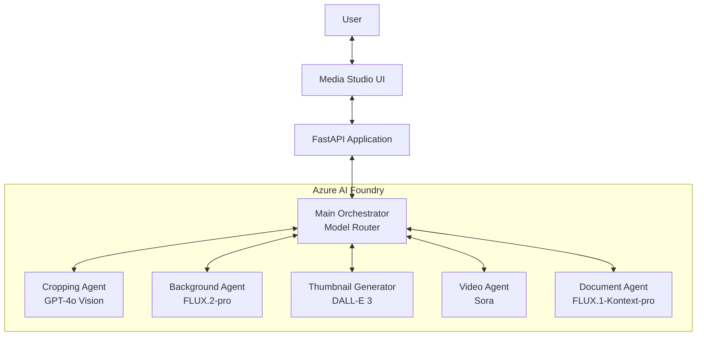

# Zava Media AI Assistant  
**Multi-Agent Architecture for Image & Video Processing**

[brown9804](https://github.com/brown9804)

Last updated: 2026-01-07

----------

<b>List of References</b> (Click to expand)

- [Foundry Models sold directly by Azure](https://learn.microsoft.com/en-us/azure/ai-foundry/foundry-models/concepts/models-sold-directly-by-azure?view=foundry-classic&pivots=azure-openai&tabs=global-standard-aoai%2Cstandard-chat-completions%2Cglobal-standard#azure-openai-in-microsoft-foundry-models) - models available 
- [Timelines for Foundry Models](https://learn.microsoft.com/en-us/azure/ai-foundry/concepts/model-lifecycle-retirement?view=foundry-classic#timelines-for-foundry-models) - retirement dates
- [Azure OpenAI in Microsoft Foundry model deprecations and retirements](https://learn.microsoft.com/en-us/azure/ai-foundry/openai/concepts/model-retirements?view=foundry-classic&tabs=text#current-models) - deprecation Date
- [Baseline architecture for an Azure Kubernetes Service (AKS) cluster](https://learn.microsoft.com/en-us/azure/architecture/reference-architectures/containers/aks/baseline-aks)
- [Run your functions from a package file in Azure](https://learn.microsoft.com/en-us/azure/azure-functions/run-functions-from-deployment-package)
- [What is Microsoft Translator Pro?](https://learn.microsoft.com/en-us/azure/ai-services/translator/solutions/translator-pro/overview)
- [Model leaderboards in Microsoft Foundry portal (preview)](https://learn.microsoft.com/en-us/azure/ai-foundry/concepts/model-benchmarks?view=foundry-classic)
- [AI Leaderboards](https://llm-stats.com/) - general ref
- [How to Stream Agent Responses](https://learn.microsoft.com/en-us/semantic-kernel/frameworks/agent/agent-streaming?utm_source=copilot.com&pivots=programming-language-python)
- [How to enable Live Streaming over Direct Line for a Copilot Studio - deployed agent?](https://github.com/Microsoft/BotFramework-WebChat/issues/5628?utm_source=copilot.com)

> [!IMPORTANT]
> Disclaimer: This repository contains a demo of `Zava Media AI Assistant`, a multi-agent system implementing Agent-to-Agent (A2A) protocol for automated media generation and manipulation. It features a fully automated `"Zero-Touch" deployment` pipeline orchestrated by Terraform, which `provisions infrastructure, creates specialized AI agents for image/video tasks in MSFT Foundry, and deploys the complete A2A application stack.` Feel free to modify this as needed, it's just a reference. Please refer [TechWorkshop L300: AI Apps and Agents](https://microsoft.github.io/TechWorkshop-L300-AI-Apps-and-agents/), and if needed contact Microsoft directly: [Microsoft Sales and Support](https://support.microsoft.com/contactus?ContactUsExperienceEntryPointAssetId=S.HP.SMC-HOME) for more guidance.

> [!IMPORTANT]
> The deployment process typically takes 15-20 minutes
>
> 1. Adjust [terraform.tfvars](./terraform-infrastructure/terraform.tfvars) values 
> 2. Initialize terraform with `terraform init`. Click here to [understand more about the deployment process](./terraform-infrastructure/README.md)
> 3. Run `terraform apply` - this automatically handles **all** deployment including agent creation and configuration

## Key Features

- **Media-Centric AI Processing**: Specialized agents for image, video, and document manipulation workflows
- **6-Agent Architecture**: Specialized AI agents with intelligent task delegation:
  - **Main Orchestrator**: Central request router (model-router) that analyzes user requests and delegates to specialized agents
  - **Image Cropping Specialist**: Smart object detection and cropping (GPT-4o vision)
  - **Background Modification Agent**: Background removal/replacement (FLUX.2-pro)
  - **Thumbnail Generation Agent**: Creates eye-catching thumbnails (DALL-E 3)
  - **Video Processing Agent**: Native video generation with Sora or image-sequence fallback
  - **Document Processor**: PDF/document analysis and extraction (FLUX.1-Kontext-pro)
- **Real-Time Image Processing**: Upload or paste images directly into the chat for immediate agent action
- **Real MSFT Foundry Agents**: Integrates with **MSFT Foundry** to create and host persistent agents
- **Zero-Touch Deployment**: A single [terraform apply](./terraform-infrastructure/README.md) command handles the entire lifecycle
- **Advanced Task Coordination**: Inter-agent task delegation (e.g., "Crop this, then change background, then add text")

## Specialized Models

Each agent uses a specialized model as its "brain" optimized for its domain:
- **Model Router** (Orchestrator): Dynamically selects best LLM (gpt-4o/gpt-4o-mini)
- **GPT-4o** (Cropping Agent): Vision and image understanding capabilities
- **FLUX.2-pro** (Background Agent): Advanced artistic image generation and manipulation
- **DALL-E 3** (Thumbnail Generator): High-quality image creation for thumbnails
- **Sora** (Video Agent): Native video generation from text prompts
- **FLUX.1-Kontext-pro** (Document Agent): Contextual understanding and PDF/document processing

> [!NOTE]
> **Multi-Model SME Collaboration**
> 
> This solution uses a **collaborative multi-agent approach** where multiple AI models work together as Subject Matter Experts (SMEs):
> 
> **Deployed Model Team:**
> - **Model Router (Orchestrator Agent)**: Dynamically routes to gpt-4o or gpt-4o-mini based on task complexity
> - **GPT-4o (Cropping Agent)**: Analyzes images, detects objects, provides cropping coordinates using vision
> - **FLUX.2-pro (Background Agent)**: Generates and manipulates backgrounds with advanced artistic capabilities
> - **DALL-E 3 (Thumbnail Agent)**: Creates eye-catching thumbnails and promotional images
> - **Sora (Video Agent)**: Native video generation from text prompts with smooth, realistic motion
> - **FLUX.1-Kontext-pro (Document Agent)**: Extracts text, analyzes PDFs, understands document context
>
> **How They Work Together:**
> 1. **Orchestrator** (model-router) analyzes user requests and routes to the appropriate specialist
> 2. **Cropping Agent** (GPT-4o) uses vision to identify and crop objects from images
> 3. **Background Agent** (FLUX.2-pro) creates or replaces backgrounds with artistic precision
> 4. **Thumbnail Agent** (DALL-E 3) generates compelling thumbnails for videos or images
> 5. **Video Agent** (Sora) creates smooth, high-quality videos from text descriptions
> 6. **Document Agent** (FLUX.1-Kontext-pro) processes PDFs and extracts structured information
>
> **Benefits of Specialized SME Models:**
> - Each model excels at its specific domain (no overlap)
> - Higher quality through specialization vs. one general-purpose model
> - Better performance: lightweight models for simple tasks, powerful models for complex ones
> - Clear separation of concerns: vision, generation, context, video
>
> [!NOTE]
> **Video Generation with Sora**
> 
> This solution uses **Sora** (version 2025-05-02) for native video generation in Azure AI Foundry.
> 
> **Sora Deployment**: The model is automatically deployed during `terraform apply`.

> [!WARNING]
> **Azure Quota and Model Availability**
> The models deployed (`GPT-4o`, `FLUX.2-pro`, `FLUX.1-Kontext-pro`, `Sora`) require GPU capacity and are subject to Azure quotas.
>
> **If you encounter deployment errors related to "Insufficient Quota"**, request a quota increase: [Azure Support](https://portal.azure.com/#blade/Microsoft_Azure_Support/HelpAndSupportBlade/newsupportrequest)
>
> **Current Deployment** uses GPT-4o-mini for fast tasks and specialized models for domain-specific operations.

## Architecture

```mermaid
graph TD
    User[User] <--> UI[Media Studio UI]
    UI <--> App[FastAPI Application]
    App <--> Orchestrator[Main Orchestrator<br/>Model Router]
    
    Orchestrator <--> Crop[Cropping Agent<br/>GPT-4o Vision]
    Orchestrator <--> BG[Background Agent<br/>FLUX.2-pro]
    Orchestrator <--> Thumb[Thumbnail Generator<br/>DALL-E 3]
    Orchestrator <--> Video[Video Agent<br/>Sora]
    Orchestrator <--> Doc[Document Agent<br/>FLUX.1-Kontext-pro]
    
    subgraph "Azure AI Foundry"
        Orchestrator
        Crop
        BG
        Thumb
        Video
        Doc
    end
```

## What Happens Under the Hood?

> When you run `terraform apply`, the following automated sequence occurs:

1. **Infrastructure Provisioning**:
   - Creates Resource Group, Azure AI Foundry, Key Vault, Storage Account, and Container Registry (ACR)
   - Deploys specialized AI Models:
     - **GPT-4o** (Vision and cropping tasks)
     - **GPT-4o-mini** (Lightweight routing tasks)
     - **DALL-E 3** (Thumbnail generation)
     - **FLUX.2-pro** (Background generation and manipulation)
     - **FLUX.1-Kontext-pro** (Document processing and contextual understanding)
     - **Sora** (Native video generation)
   - All models use **Managed Identity** for secure authentication (no API keys stored)

2. **Automated Agent Creation**:
   - **Fully automated by Terraform**: No manual intervention required
   - Installs the `azure-ai-projects` SDK and connects to MSFT Foundry
   - Creates specialized media processing agents with specific model assignments
   - Automatically stores agent IDs in Azure Key Vault for secure access
   - Web app retrieves agent configuration from Key Vault automatically
   - **Zero manual configuration** - Terraform handles all agent deployment and setup

3. **Application Deployment**:
   - Builds the Docker container in the cloud (ACR Build)
   - Configures the Azure Web App with the generated Agent IDs and Managed Identity
   - Deploys the container and restarts the app

## Verification

> After deployment completes, verify the system:

1. **Check the Web App**:
   - The Terraform output will provide the `application_url`
   - Visit `https://<your-app-name>.azurewebsites.net`
   - You should see the Zava Media AI interface

2. **Verify Agent Architecture**:
   - Go to the [MSFT Foundry Portal](https://ai.azure.com)
   - Navigate to your project -> **Build** -> **Agents**
   - You should see the specialized media agents listed with their assigned models
   - **Agent IDs are automatically stored in Azure Key Vault** and retrieved by the web app

3. **Test Media Processing**: For example:
   - **Image Upload**: Upload an image and ask "Crop the main subject"
   - **Background**: "Change the background to a beach scene"
   - **Thumbnail**: "Create a thumbnail with the text 'AMAZING'"
   - **Multi-Step**: "Crop the car, put it on a race track background, and add the text 'SPEED' in red"
   - **Video**: "Generate a 5-second video of a sunset over mountains"
   - **Document**: "Extract all text from this PDF" or "Summarize this document"

<!-- START BADGE -->

  
  
Refresh Date: 2026-01-07

<!-- END BADGE -->
